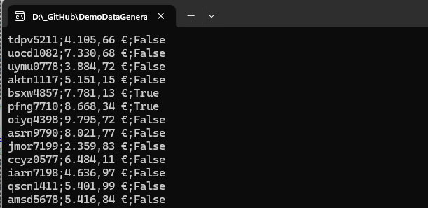

<a id="readme-top"></a>
# Demo Daten Generator

[](#)
[](#)


Das Tool erstellt für eine Klasse Demodaten für den jeweiligen Typ.
Demodaten können für viele Zwecke, z.B. zum Test von Control um Daten für die Darstellen anzeigen zu können.
Demodaten können als Liste oder DataTable erstellt werden.

### Demodaten Generator: Einsatzmöglichkeit

- CreateForList für eine Liste List< T>
- CreateForICollectionView für ein ICollectionView
- CreateForDataTable für eine DataTable auf Basis einer Modelklasse
- CreateForDictionary für ein Dictionary< Tkey, Tvalue> auf Basis eines KeyValuePair<Tkey, Tvalue >

#### Beispiel für eine Model-Klasse
```csharp
public class UserDemoDaten
{
        public string UserName { get; set; }
        public bool IsDeveloper { get; set; }
        public decimal Betrag { get; set; }
        public DateTime CreateOn { get; set; }
        public string CreateBy { get; set; }
        public DateTime ModifiedOn { get; set; }
        public string ModifiedBy { get; set; }
}
```

### Die Demodaten werden erstellt und als ein Collection Type zurückgegeben
#### Die Demodaten werden erstellt und als IEnumerable<T> zurückgeben.
```csharp
IEnumerable<UserDemoDaten> users = DemoDataGenerator<UserDemoDaten>.CreateForList<UserDemoDaten>(ConfigObject, 100);
foreach (UserDemoDaten user in users)
{
   Console.WriteLine($"{user.UserName};{user.Betrag.ToString("C2")};{user.IsDeveloper}");
}
```

#### Die Demodaten werden erstellt und als Dictionary< Tkey, Tvalue> zurückgeben.
```csharp
Dictionary<object, object> users = BuildDemoData<KeyValuePair<int, string>>.CreateForDictionary<KeyValuePair<int, string>>(ConfigObjectInt, 100);
foreach (KeyValuePair<object, object> user in users)
{
    Console.WriteLine($"{user.Key};{user.Value}");
}
```

#### Konfiguration der Demodaten über eine Callback-Klasse
```csharp
private static UserDemoDaten ConfigObject(UserDemoDaten demoDaten)
{
    var timeStamp = TestDataGenerator.SetTimeStamp();
    demoDaten.UserName = TestDataGenerator.Username();
    demoDaten.Betrag = TestDataGenerator.Currency(1_000, 10_000);
    demoDaten.IsDeveloper = TestDataGenerator.Boolean();
    demoDaten.CreateOn = timeStamp.CreateOn;
    demoDaten.CreateBy = timeStamp.CreateBy;
    demoDaten.ModifiedOn = timeStamp.ModifiedOn;
    demoDaten.ModifiedBy = timeStamp.ModifiedBy;

    return demoDaten;
}
```

#### Ergebnis



### Methoden zum Erstellen von Demodaten

|Methode|Typ|Beschreibung|
|:------|:--|:-----------|
|Letters()|string|Erstellen eines String mit Buchstaben|
|AlphabetAndNumeric()|string|erstellen eines Strings mit Buchstaben und Zahlen|
|Username()|string|Erstellen eines String im Format xxxx9999|
|Double()|double|Erstellen einer Double Zahl|
|Decimal()|decimal|Erstellen einer Decimal Zahl|
|Integer()|Int|Erstellen einer Int Zahl|
|Boolean()|bool|Erstellen eines True/False Inhalt|
|Word()|string|Erstellen eines Strings aus einer Wortliste|
|City()|string|Erstellen eines string mit einer Stadt|
|ColorName()|string|Farbname|
|Symbols()|string|Symbol aus PathGeometry Koordinaten|
|SetTimeStamp()|Tuple<>|Timestamp erstellen|

# History


- Demodaten für den Typ ICollectionView hinzugefügt


- Erste Version des Demodatengenerator
